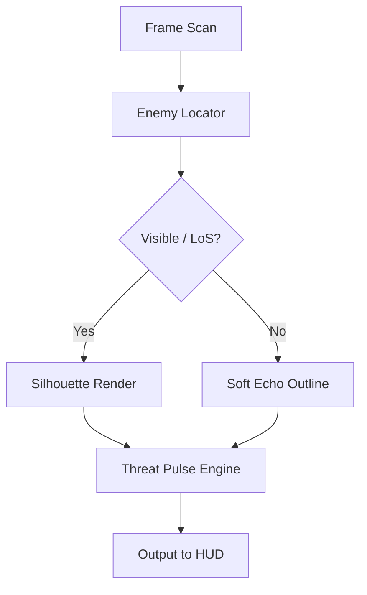

# 🌌 Overview

The **Overwatch 2 Dynamic ESP Vision Suite** is an adaptive awareness overlay engineered for players who crave deeper tactical insight.
Unlike static ESP tools, this module reacts—its silhouettes thicken during aggression, distance rings shift with speed, and vertical arrows pulse for airborne threats.

It fits every role—hitscan, projectile, tank anchor, support guardian—acting as a sixth sense stitched elegantly into your peripheral vision.

---

# ⭐ Feature Set

### **👁 Reactive Silhouette ESP**

Contours brighten when enemies charge an ability or peek toward your sightline.

### **📡 Cooldown Echo Indicators**

Displays soft color pulses hinting at approximate enemy cooldown cycles (dash, jump, shift abilities).

### **🎯 Hitbox Horizon Marks**

Outlines crucial hit zones—head, center-mass, critical weak points—for precise flicking.

### **🛡 Shield & Armor Mapping**

Color-coded layers show enemy durability types through partial obstructions.

### **🌀 Vertical Threat Compass**

Pharah, Echo, Widow on a high ledge—marked with drifting arrows showing height + angle.

### **🔄 Auto-Scaling Awareness Profiles**

Hot-swap mid-match:

* DuelistClarity
* SupportGuardian
* TankAnchor
* ProjectileSense

---


---

# 🧩 Compatibility

| Component              | Support | Notes                              |
| ---------------------- | ------- | ---------------------------------- |
| **OW2 Battle.net**     | ✔️      | Fastest overlay lock               |
| **OW2 Steam**          | ✔️      | Auto-calibrates offsets            |
| **DX11**               | ✔️      | Recommended for smooth silhouettes |
| **DX12**               | ✔️      | Supported with fallback hooks      |
| **Ultrawide Monitors** | ✔️      | Auto-aspect scaling                |
| **Controller Input**   | ✔️      | ESP timing syncs with stick turns  |

[!IMPORTANT]
Borderless window mode ensures the overlay anchors perfectly to hero models and camera shifts.

---

# ⚡ Setup Guide

1. **Download** the Dynamic ESP Vision Suite archive.

2. Extract into a clean directory such as:
   `C:/OW2_DynamicESP/`

3. Launch Overwatch 2.

4. Run the module:

   ```bash
   OW2_DynamicESP.exe --vision
   ```

5. Select an awareness style:

   * `ReactiveGlow`
   * `VerticalPulse`
   * `EnemyThreatMap`
   * `SupportClarityLite`

6. Tune ESP parameters:

   * Silhouette Opacity: `0.25–0.55`
   * Threat Pulse Speed: `0.4–0.9`
   * Vertical Arrow Strength: `0.18–0.36`
   * Distance Ring Density: `20–70m`

7. Press **F7** to toggle in-game.

---

# 🌀 Mermaid Vision Flow Diagram



This rhythmic pipeline ensures ESP reacts rather than merely displays—breathing with the fight as it unfolds.

---

# ✨ Advanced Vision Modules

### **Aggression Heat Indicators**

Silhouettes warm from blue → amber → red based on movement velocity + predicted aggression.

### **Cooldown Mirage Layer**

A faint ripple appears around heroes likely regaining key mobility abilities.

### **Foreshadow Trail System**

Projectile heroes (Hanzo, Junkrat, Pharah) show a brief line of trajectory anticipation.

### **Support Awareness Halo**

Enemies threatening your support line glow in a gradient radius—even off-screen.

[!NOTE]
For hitscan duelists (Cassidy, Soldier, Ashe), reduce silhouette opacity and increase threat pulses for minimal distraction.

---

# 🔧 Config Examples

### **DuelistClarity**

```ini
[esp]
opacity=0.32
vertical_threat=0.22
pulse_speed=0.70
distance_rings=35
```

### **SupportGuardian**

```ini
[vision]
threat_radius=90
soft_echo=true
cooldown_hint=true
offscreen_arrows=true
```

### **TankAnchor**

```ini
[tracking]
silhouette_thickness=1.6
armor_map=true
aggro_pulse=0.45
```

---

# ❓ FAQ

### **Does Dynamic ESP impact FPS?**

Only slightly—less than 5–7% on typical setups thanks to optimized draw calls.

### **Is the ESP modular?**

Yes—disable silhouettes, pulses, arrows, rings, or cooldown hints individually.

### **Do profiles auto-switch by hero?**

Optional. You can bind presets to specific heroes.

### **Does it work with controller players?**

Perfectly—ESP reacts to camera sway and stick micro-movement.

### **Does the suite auto-update?**

Offsets and render anchors refresh after each OW2 patch.

---

# 🌠 Final Thoughts

Overwatch 2 is a luminous battleground, a place where brilliance and chaos tangle like twin comets.
**Dynamic ESP Vision** doesn’t twist that beauty—it sharpens it.
Silhouettes gleam, threats whisper, vertical dangers drift into focus.
You move not blindly, but like someone who sees the battlefield from the inside out.

Let clarity be your quiet edge.
Let awareness turn the tide.

---
